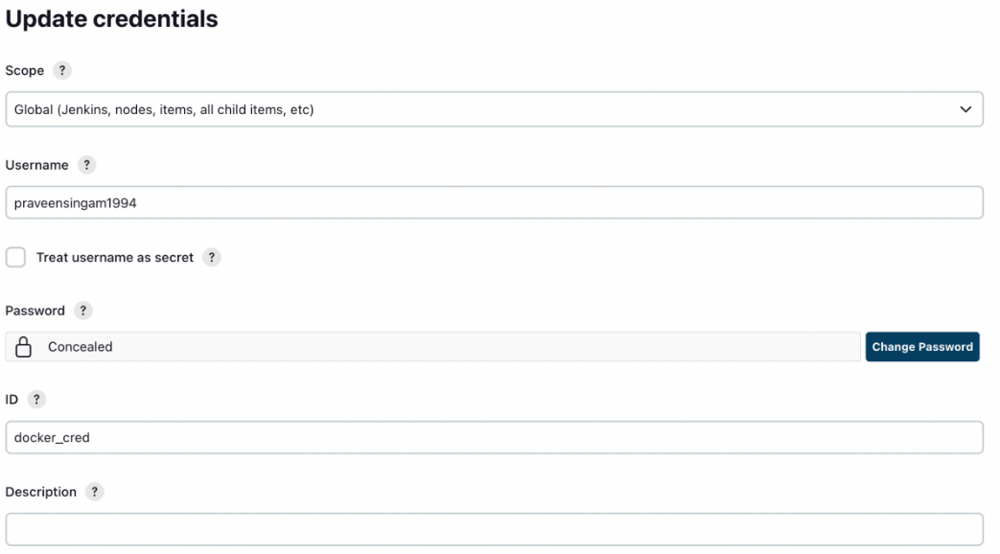
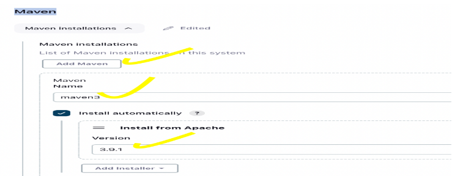
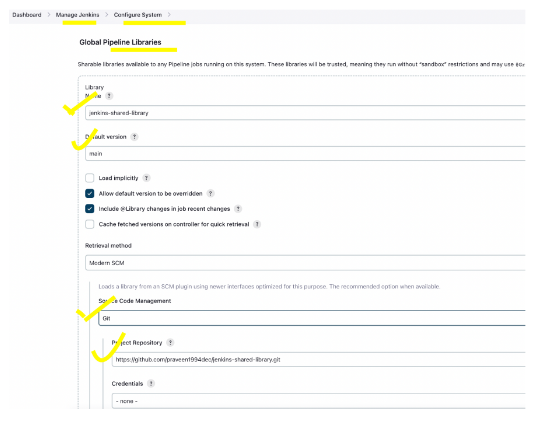

# CICD_Pipeline_Dockerfile

In Jenkins image:
-Installed Docker
-Installed Kubectl
-Installed AWS CLI
-Installed EKSCTL
-Installed Ansible

to run, use command

docker run -d -it -p 8080:8080 -p 50000:50000 -v /var/run/docker.sock:/var/run/docker.sock -v jenkins_home:/var/jenkins_home jenkins

*** CONFIGURE AWS CLI ***

run command to see the id of the container

docker ps

docker exec -it <id> bash

aws configure

Insert access key, secret access key, region and default output format

*** CREATE EKS CLUSTER ***

eksctl create cluster \
	--name first-eks-cluster \
	--version 1.24 \
	--region us-west-1 \
	--nodegroup-name worker-nodes \
	--node-type t2.micro \
	--nodes 2

*** CONFIGURE JENKINS ***

In a browser, access localhost:8080
Paste administrator password
Install suggested plugins

Jenkins -> Manage Jenkins -> Manage Credentials -> Stored scoped to jenkins -> global -> Add Credentials

Add dockerhub credentials

Add Maven in Global Tool Configuration

Add Jenkins managed library

Go to Manage Jenkins -> Configure System -> Global Pipeline Libraries ->
Give Library name – jenkins-shared-library 
Default Version - main
Project Repository - https://github.com/DEVOPS-WITH-WEB-DEV/jenkins-shared-library1.git

Create new Jenkins Pipeline

Add Pipeline script
Click on Configure -> Select Pipeline ->

https://github.com/praveen1994dec/spring-cloud-kubernetes/blob/main/kubernetes-configmap-reload/Jenkinsfile 

-> Copy that Jenkinsfile -> Paste it in Pipeline Script in Jenkins

SELECT BUILD WITH PARAMETERS [ IF FAILS AGAIN START THE PIPELINE ]
